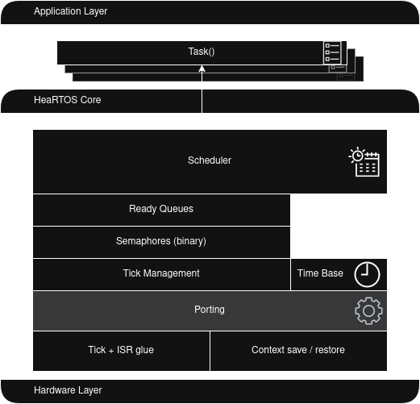
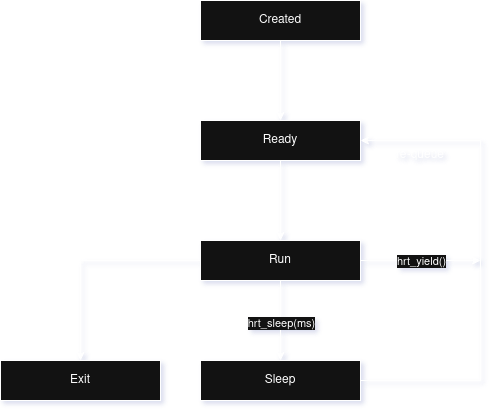
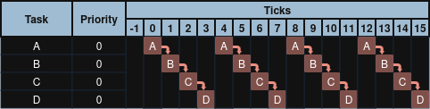
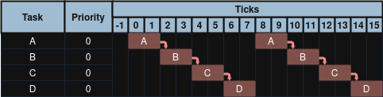
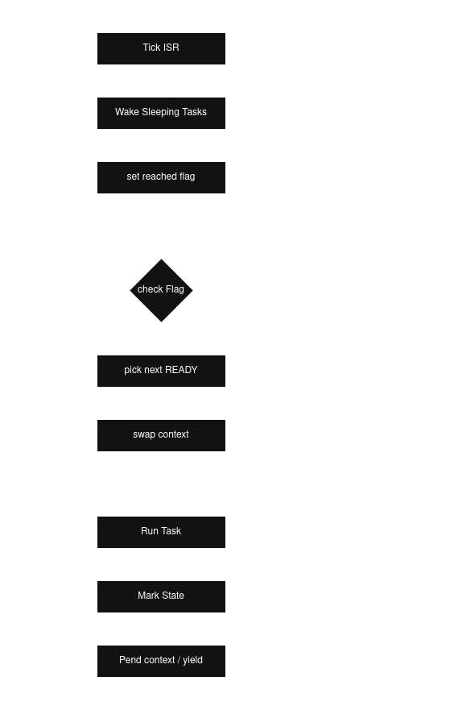

# 🫀 HardRT [[ExoSpaceLabs](https://github.com/ExoSpaceLabs)]

**HardRT** is the heartbeat of small embedded systems.  
A tiny, portable, modular real-time operating system written in C.  
Minimal footprint, predictable behavior, and zero hardware dependencies in its core.

**Version:** `0.3.1`

---

## ✨ Features
- **Pure C core** — no dynamic allocation, no HAL dependencies.
- **Portable ports** — currently: null, posix, cortex-m.
- **Scheduler** — priority, round-robin, or hybrid; RR currently rotates on yield/sleep.
- **Binary semaphores** — blocking take, `try_take`, ISR-safe `give` with FIFO wake-up.
- **Static tasks** — stacks and TCBS supplied by the application.
- **CMake package** — install and consume via `find_package(HardRT)`.
- **Generated metadata** — version and port headers at build time.
- **Optional C++17 wrapper** — header-only interface target when enabled. See [C++ Guide](docs/CPP.md).

Please refer to [PORTING.md](docs/PORTING.md) for additional port inclusion.

> The POSIX port is for logic verification, not timing accuracy. ucontext is used and supported on Linux/glibc.

> “On Cortex-M, the max time from tick to running the next highest priority ready task is bounded by: ISR tail + PendSV latency + context save/restore”

---

### Architecture

> the architecture requires to be updated. Diagram shows project name prior re-branding.



The Architecture is mainly divided into three layers:
- **Application Layer**: Where the tasks are defined. e.g., camera, UART downlink, HK/FDIR, etc.
- **HardRT Core**: Where the RTOS lives, manages tasks, and calls the port to switch context when necessary.
  - **HardRT Port**: Wraps the hardware-specific methods.
- **Hardware Layer**: Hardware specific methods, registers, primitives, etc.

> “Event-to-task latency in HardRT depends on task priority. When multiple tasks are woken concurrently, 
> the highest-priority task consistently achieves minimal latency, while lower-priority tasks incur bounded 
> additional delay.”

### Task State Machine


Where each task is executed in accordance with the policy adopted by the scheduler.

> Note: If a task exits, it will yield forever.

see also [Concepts](#-concepts)

## 📁 Repository Layout
```
hardrt/
├── inc/                    # Public headers
├── src/                    # Core + port implementations
│   ├── core/               # Kernel internals
│   └── port/               # Architecture-specific backends (null, posix, cortex_m)
├── cpp/                    # Optional C++17 interface
├── cmake/                  # additional cmake files and toolchains
├── examples/               # Example applications
├── tests/                  # POSIX test harness
├── scripts/                # scripts to build and test the project
├── docs/                   # Documentation
├── LICENSE
└── README.md
```

---

## ⚙️ Build
```bash
mkdir -p build && cd build
cmake -DHARDRT_PORT=posix -DHARDRT_BUILD_EXAMPLES=ON ..
cmake --build . -j$(nproc)
./examples/two_tasks/two_tasks
```
Install package:
```bash
cmake --install . --prefix "$PWD/install"
```

Consume from another CMake project:
```cmake
find_package(HardRT 0.2.0 REQUIRED)
add_executable(app main.c)
target_link_libraries(app PRIVATE HardRT::hardrt)
```
For further information and CMake flags, see the [Build](docs/BUILD.md) document.

---

## 🧠 Concepts

### Tick vs Timeslice
- **Tick:** base time unit generated by a timer interrupt (or POSIX signal). HardRT increments a counter each tick and wakes sleepers.
- **Timeslice:** number of ticks a task may run before being rotated under RR. In v0.3.0, rotation happens on yield/sleep; strict preemption at the slice end is planned.


### Policy: Round‑robin within one priority (Sequence at tick times)



Caption:
- Policy: `HRT_SCHED_PRIORITY_RR` (RR applies within same priority).
- Two READY tasks with `timeslice=1 ms`. Handoffs occur exactly at every tick...
- Self-transitions mark per-tick continuity when no interrupt/context switch occurs.



Caption:
- Identical example with `timeslice=2 ms` is shown below, in essence handoffs occur every two ticks.

each task is executed in order.

### Policy: Priority preemption (Sequence at tick times)


Caption:
- this example shows four tasks with different priorities.
- D the lowest priority task running continuously.
- D is interrupted at T6 by Task A lasting one tick and resumes Task D.
- D is interrupted once again by higher priority task C at T10 lasting three ticks.
- C as well is interrupted by Task B (an even higher task) at T11 lasting two ticks.
- B returns to C, which finishes the remaining work (two more ticks); and returns to D.
- Self-transitions mark per-tick continuity when no interrupt/context switch occurs.


> RR with preemption allows the usage of both policies within the same context.

---

### Semaphores (binary)
- `hrt_sem_init`, `hrt_sem_take`, `hrt_sem_try_take`, `hrt_sem_give`, `hrt_sem_give_from_isr`.
- Use as a mutex substitute or an event signal. For mutex-like use, enabling immediate handoff on give is recommended (see roadmap).

### Scheduling Flow


Tick (ISR/signal) -> hrt_tick_from_isr():
- g_tick++
- wake any SLEEP tasks whose wake_tick ⇐ now
- hrt__pend_context_switch() (set resched flag)

Scheduler loop (port):
- if resched flag:
  -  next = hrt__pick_next_ready()
  -  swapcontext/PendSV to next task

Task-level yield/sleep:
- mark state (READY→queue or SLEEP)
- hrt__pend_context_switch()
- hrt_port_yield_to_scheduler() (safe handoff from task ctx)

---

## Statistics

HardRT v0.3.0 demonstrates:
- Deterministic priority-based scheduling
- Predictable and explainable latency behavior under contention
- Event → task latencies on the order of **~19–25 µs average** on Cortex-M7 @ 64 MHz under debug-attached conditions

See [STATISTICS.md](docs/STATISTICS.md) for detailed information on timing and tests.

These results provide a solid baseline for further optimization and for documenting real-time behavior guarantees.

---
## 📜 License
Apache License 2.0 — see [LICENSE](LICENSE).
