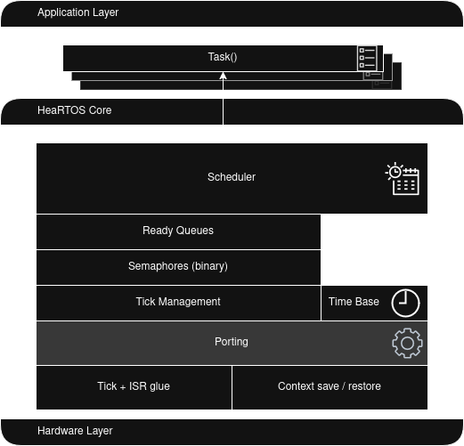
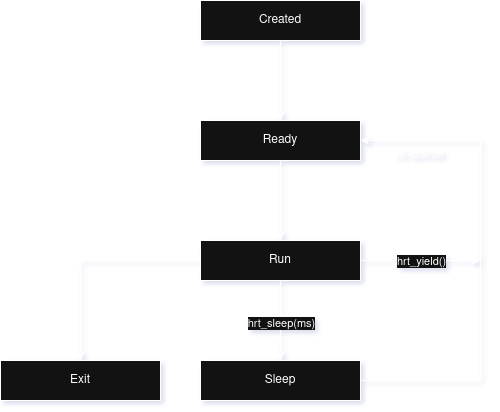

<p align="center">
  
</p>

<p align="center">
  <strong>Minimal Real-Time Operating System</strong><br>
  <a href="https://github.com/ExoSpaceLabs">ExoSpaceLabs</a>
</p>

**HardRT** is a small, portable real-time operating-system kernel written in C.
The core uses static allocation and has no HAL dependency.

**Version:** `0.4.0`

## Features available in v0.4.0

- **Pure C core:** no dynamic allocation and no hardware abstraction layer in the kernel.
- **Ports:** `null`, `posix`, and `cortex_m`.
- **Static tasks:** task stacks are supplied by the application.
- **Scheduling:** fixed-priority scheduling with optional round-robin time slicing inside priority classes.
- **Task control:** `hrt_sleep()`, `hrt_yield()`, `hrt_task_delete()`, `hrt_tick_now()`, and `hrt_now_ms()`.
- **Semaphores:** binary and counting modes, FIFO waiter queues, and ISR-safe give.
- **Mutexes:** owner-tracked, non-recursive, FIFO waiter queues, and direct handoff.
- **Message queues:** fixed-size, copy-based FIFO queues with task and ISR operations.
- **CMake package:** installation and consumption through `find_package(HardRT)`.
- **Optional C++17 wrapper:** header-only wrappers enabled with `HARDRT_ENABLE_CPP`.

The current release does not provide IPC timeouts, mutex priority inheritance, event flags, task notifications, tickless idle, or high-resolution timers.

## Port behavior

The Cortex-M port uses SysTick or an application-provided external tick and performs context switching through PendSV.

The POSIX port is a logic and scheduler simulator for Linux/glibc. It uses `ucontext` and a `SIGALRM` tick. The signal handler performs tick accounting and requests rescheduling, but it does not switch task contexts directly. A POSIX task returns control to the scheduler only when it calls a HardRT scheduling point, such as sleep, yield, a blocking IPC operation, task deletion, or task return. A CPU-bound task that never reaches such a point can prevent other POSIX tasks from running.

The POSIX port is not a timing-accurate model of Cortex-M execution. It is regularly exercised on Ubuntu and GitHub-hosted Linux runners. A test-suite failure has been observed on Debian 13 with GCC 14 and glibc 2.41.

See [the porting guide](docs/PORTING.md) for the current port contract.

## Architecture



HardRT is divided into three layers:

- **Application:** task functions and application-owned storage.
- **HardRT core:** task state, ready queues, timing, and synchronization primitives.
- **Port:** architecture-specific tick, critical-section, idle, stack-frame, and context-switch operations.

### Task state machine



A task that returns from its entry function is passed to `hrt_task_delete()`, marked unused, and is not scheduled again.

## Repository layout

```text
hardrt/
├── inc/                    # Public and port-facing headers
├── src/
│   ├── core/               # Kernel implementation
│   └── port/               # null, posix, and cortex_m ports
├── cpp/                    # Optional C++17 wrapper
├── cmake/                  # Package files and toolchains
├── examples/               # Example applications
├── tests/                  # POSIX test harness
├── scripts/                # Build and test helpers
├── docs/                   # Documentation
├── LICENSE
└── README.md
```

## Build

```bash
cmake -S . -B build \
  -DHARDRT_PORT=posix \
  -DHARDRT_BUILD_EXAMPLES=ON
cmake --build build -j
./build/examples/two_tasks/two_tasks
```

Install the package:

```bash
cmake --install build --prefix "$PWD/build/install"
```

Consume it from another CMake project:

```cmake
find_package(HardRT 0.4.0 REQUIRED)
add_executable(app main.c)
target_link_libraries(app PRIVATE HardRT::hardrt)
```

See [BUILD.md](docs/BUILD.md) for the current prerequisites and CMake options.

## Scheduling in the current implementation

Priority `0` is the highest priority. Ready tasks are stored in one FIFO queue per priority, and the scheduler always selects the first task from the highest non-empty priority queue.

- `HRT_SCHED_PRIORITY` uses fixed-priority selection without tick-driven time-slice rotation.
- `HRT_SCHED_RR` enables time-slice accounting, but task selection still uses the priority queues in v0.4.0.
- `HRT_SCHED_PRIORITY_RR` also uses fixed-priority selection and rotates time-sliced tasks within the same priority class.
- A task with `timeslice == 0` is cooperative and is not rotated when ticks expire.

Consequently, `HRT_SCHED_RR` is not a priority-independent global round-robin policy in the current implementation.

A timeslice is expressed in **ticks**, not milliseconds. Its wall-clock duration depends on `tick_hz`.

## Tick sources

- `HRT_TICK_SYSTICK`: the selected port owns the periodic tick and calls the private core tick handler.
- `HRT_TICK_EXTERNAL`: the application owns the timer and calls `hrt_tick_from_isr()` from that timer ISR.

Tick processing increments the tick counter, wakes expired sleepers, updates the running task's slice, and requests rescheduling only when a wake-up or slice expiry requires it. It never performs a task-context switch directly.

See [TICK_SOURCE.md](docs/TICK_SOURCE.md) for details.

## Task timing

`hrt_sleep(ms)` converts milliseconds to ticks using ceiling division. Positive durations shorter than one tick sleep for one tick. In v0.4.0, `hrt_sleep(0)` also sleeps for one tick; use `hrt_yield()` for an immediate voluntary scheduling point.

## Synchronization

### Semaphores

- `hrt_sem_init`, `hrt_sem_init_counting`
- `hrt_sem_take`, `hrt_sem_try_take`
- `hrt_sem_give`, `hrt_sem_give_from_isr`

Semaphores use FIFO waiter queues and direct handoff. They are not owner-tracked.

### Mutexes

- `hrt_mutex_init`, `hrt_mutex_lock`, `hrt_mutex_try_lock`, `hrt_mutex_unlock`

Mutexes are task-context-only, non-recursive, and owner-tracked. The current implementation has no priority inheritance or timed lock.

### Message queues

- `hrt_queue_init`
- blocking and non-blocking send/receive
- non-blocking ISR send/receive

Queue items are copied with `memcpy` while the queue operation holds the port critical section. Keep items small or enqueue pointers/indices whose lifetime is managed by the application.

## Timing measurements

[STATISTICS.md](docs/STATISTICS.md) contains measurements collected on an STM32H755 Cortex-M7 setup. Those values characterize that recorded configuration and workload; they are not general worst-case execution-time guarantees for every application, interrupt layout, build, or memory configuration.

## License

Apache License 2.0. See [LICENSE](LICENSE).