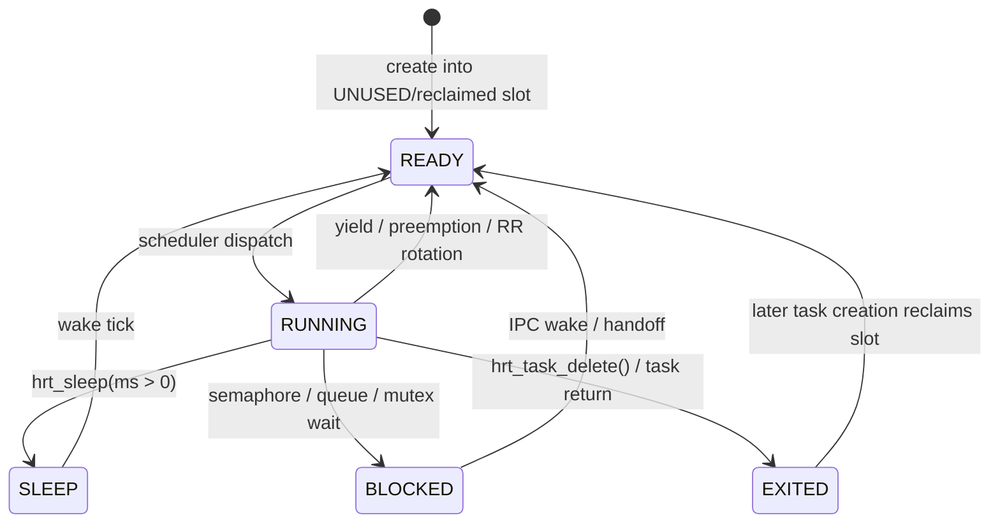

<p align="center">
  
</p>

<p align="center">
  <strong>Minimal Real-Time Operating System</strong><br>
  <a href="https://github.com/ExoSpaceLabs">ExoSpaceLabs</a>
</p>

**HardRT** is a small, portable real-time operating-system kernel written in C. The core uses static allocation and has no HAL dependency.

**Released version:** `0.4.0`  
**Current development line:** v0.5.0

## Current feature set

- **Pure C core:** no dynamic allocation and no hardware abstraction layer in kernel runtime paths.
- **Ports:** `null`, `posix`, and `cortex_m`.
- **Static tasks:** application-supplied task stacks and bounded task capacity.
- **Scheduling:** fixed priority, true global round-robin, and fixed-priority round-robin on `develop`.
- **Task control:** sleep, yield, task deletion/return, tick/time queries, and runtime task creation.
- **Semaphores:** binary/counting modes, FIFO waiters, ISR-safe give.
- **Mutexes:** owner-tracked, non-recursive, FIFO waiters, direct handoff.
- **Message queues:** fixed-size copy-based FIFO queues with task and ISR operations.
- **CMake package:** installation and `find_package(HardRT)` consumption.
- **Optional C++17 wrapper:** header-only wrappers enabled with `HARDRT_ENABLE_CPP`.

Event flags and task notifications are planned for v0.5.0 but are not implemented yet. IPC timeout variants, mutex priority inheritance, tickless idle and high-resolution timers are also not currently provided.

## Port behavior

The Cortex-M port uses SysTick or an application-provided external tick and performs context switching through PendSV.

The POSIX port is a logic and scheduler simulator for Linux/glibc. It uses `ucontext` and a `SIGALRM` tick. The signal handler performs tick accounting and requests rescheduling, but it does not switch task contexts directly. A POSIX task returns control to the scheduler only at a HardRT scheduling point such as sleep, yield, blocking IPC, task deletion or task return. A CPU-bound task that never reaches such a point can prevent other POSIX tasks from running.

The POSIX port is not a timing-accurate model of Cortex-M execution. See [the porting guide](docs/PORTING.md) for the current port contract.

## Architecture


HardRT is divided into three layers:

- **Application:** task functions and application-owned storage.
- **HardRT core:** task/slot lifecycle, READY storage, timing and synchronization primitives.
- **Port:** architecture-specific tick, critical-section, idle, stack-frame and context-switch operations.

### Task and slot lifecycle

TCB slot ownership and task execution state are intentionally separate.

A slot is either `UNUSED` or `USED`. A used application task can be `READY`, `RUNNING`, `SLEEP`, `BLOCKED`, or `EXITED`.


```mermaid
stateDiagram-v2
    [*] --> READY: create into UNUSED/reclaimed slot

    READY --> RUNNING: scheduler dispatch
    RUNNING --> READY: yield / preemption / RR rotation

    RUNNING --> SLEEP: hrt_sleep(ms > 0)
    SLEEP --> READY: wake tick

    RUNNING --> BLOCKED: semaphore / queue / mutex wait
    BLOCKED --> READY: IPC wake / handoff

    RUNNING --> EXITED: hrt_task_delete() / task return
    EXITED --> READY: later task creation reclaims slot
```

Important invariants on `develop`:

- a RUNNING application task is **not** in READY storage;
- a READY application task has exactly one READY representation;
- an EXITED task does not execute again, but its slot remains USED until later reclamation;
- the private idle task is not stored in application READY queues;
- task-stack overlap with a live task is rejected;
- runtime task creation while RUNNING is supported and joins READY at the next scheduling point.

## Repository layout

```text
hardrt/
├── inc/                    # Installed public headers
├── src/
│   ├── core/               # Kernel implementation
│   ├── internal/           # Non-installed core/port contract
│   └── port/               # null, posix, cortex_m
├── cpp/                    # Optional C++17 wrapper
├── cmake/                  # Package files and toolchains
├── examples/               # Example/qualification applications
├── tests/                  # Hosted tests and installed consumers
├── scripts/                # Build and qualification helpers
├── docs/                   # Documentation
├── LICENSE
└── README.md
```

## Build

```bash
cmake -S . -B build \
  -DHARDRT_PORT=posix \
  -DHARDRT_BUILD_EXAMPLES=ON
cmake --build build -j
./build/examples/two_tasks/two_tasks
```

Install the package:

```bash
cmake --install build --prefix "$PWD/build/install"
```

Consume it from another CMake project:

```cmake
find_package(HardRT 0.4.0 REQUIRED)
add_executable(app main.c)
target_link_libraries(app PRIVATE HardRT::hardrt)
```

See [BUILD.md](docs/BUILD.md) for prerequisites and CMake options.

## Scheduling on `develop`

Priority `0` is the highest priority.

- `HRT_SCHED_PRIORITY` uses strict fixed-priority FIFO scheduling. A strictly higher-priority wake preempts; equal- and lower-priority wakes wait.
- `HRT_SCHED_RR` uses one global READY FIFO and ignores task priority. Yield or quantum expiry rotates to the global tail; a wake joins the tail without stealing the current task's remaining quantum.
- `HRT_SCHED_PRIORITY_RR` uses strict priority selection and round-robin only inside the selected priority class. A task interrupted by higher-priority work retains queue precedence and unused quantum.
- `timeslice == 0` disables tick-driven rotation for that task.

Runtime switching among the three policies rebuilds READY membership under the kernel critical section.

The released v0.4.0 behavior differs in several places, including global RR semantics and `hrt_sleep(0)`. See [SCHEDULING.md](docs/SCHEDULING.md) and release notes when moving between versions.

## Tick sources

- `HRT_TICK_SYSTICK`: the selected port owns the periodic tick. Configuration occurs during `hrt_init()`, but activation waits until scheduler start.
- `HRT_TICK_EXTERNAL`: the application owns the timer and calls `hrt_tick_from_isr()` from its ISR.

An application-owned external tick must not begin routing interrupts into HardRT before scheduler execution has started. The physical H755 validator therefore starts its external TIM2 source from the first dispatched task rather than before `hrt_start()`.

Calling `hrt_tick_from_isr()` while `HRT_TICK_SYSTICK` is selected does not advance time and records `ERR_TICK_SOURCE_MISMATCH`.

Tick processing increments time, advances the intrusive sleeper queue, updates the running task's slice and requests rescheduling only when required. It never directly executes another task from the tick ISR.

See [TICK_SOURCE.md](docs/TICK_SOURCE.md).

## Task timing

On `develop`, positive `hrt_sleep(ms)` durations use ceiling conversion to ticks. `hrt_sleep(0)` is an immediate scheduling point with the same rotation semantics as `hrt_yield()` and does not enter the sleep queue.

The released v0.4.0 behavior treated `hrt_sleep(0)` as a one-tick sleep.

## Synchronization

### Semaphores

Binary/counting semaphores use FIFO waiters and scheduler-aware wake decisions. ISR give is supported.

### Mutexes

Mutexes are task-context-only, non-recursive and owner-tracked. They use FIFO waiters and direct handoff. The current implementation has no priority inheritance, timed lock or automatic owner-death recovery. A task must release owned mutexes before returning or deleting itself.

### Message queues

Queues provide blocking and non-blocking task operations plus non-blocking ISR send/receive. Items are copied with `memcpy()` while the queue critical section is held, so item size remains part of the real-time cost model.

## Current hardware qualification status

The v0.5 scheduler/lifecycle hardening phase has an accepted NUCLEO-H755ZI-Q CM7 development baseline on exact SHA:

```text
80f2042f2c64053a9ea888666474c5dad5f72797
```

Full unfiltered result:

```text
Board probe:           PASS
Functional contracts:  11 / 11 PASS
Hardware benchmarks:   22 / 22 PASS
Overall:                PASS
```

This demonstrates that the current scheduler, lifecycle, Cortex-M context, tick, `BASEPRI`, semaphore, queue and mutex contracts pass the repository's physical-board suite. It is **development evidence**, not an unconditional WCET guarantee and not the final v0.5.0 release package. The final RC must repeat the suite on the exact frozen release SHA.

See [QUALIFICATION.md](docs/QUALIFICATION.md), [STATISTICS.md](docs/STATISTICS.md), and [HARD_REAL_TIME.md](docs/HARD_REAL_TIME.md).

## Hard real-time claims

HardRT is being engineered toward configuration-specific hard-real-time guarantees on supported Cortex-M targets. Remaining work includes full critical-section characterization, bounded priority-inversion handling, queue-copy scaling, interference analysis and more complete machine-readable timing metadata.

Measured maxima are not automatically WCET proofs.

## License

Apache License 2.0. See [LICENSE](LICENSE).
