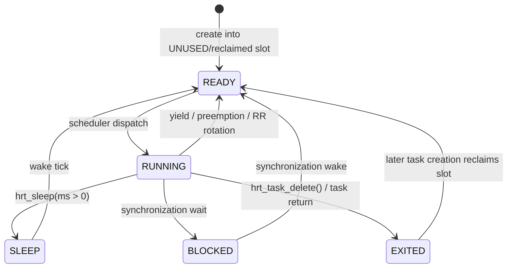

<p align="center">
  
</p>

<p align="center">
  <strong>Minimal Real-Time Operating System</strong><br>
  <a href="https://github.com/ExoSpaceLabs">ExoSpaceLabs</a>
</p>

**HardRT** is a small, portable real-time operating-system kernel written in C. The core uses static allocation and has no HAL dependency.

**Version:** `0.5.0`

## Feature set

- **Pure C core:** no dynamic allocation and no HAL dependency in kernel runtime paths.
- **Ports:** `null`, `posix`, and `cortex_m`.
- **Static tasks:** application-owned stacks, bounded task capacity, runtime creation, and EXITED-slot reclamation.
- **Scheduling:** fixed priority, true global round-robin, and fixed-priority round-robin.
- **Task control:** sleep, yield, deletion/return, tick/time queries, and runtime policy/default-slice tuning.
- **Semaphores:** binary/counting modes, FIFO waiters, ISR-safe give.
- **Mutexes:** owner-tracked, non-recursive, FIFO waiters, direct handoff.
- **Message queues:** fixed-capacity copy-based FIFOs with task and ISR operations.
- **Event flags:** 32-bit wait-any/wait-all flags with retained/clear-on-exit behavior and ISR producers.
- **Task notifications:** one private 32-bit notification per task with set-bits, overwrite, no-overwrite, increment, wait, take, and ISR producers.
- **CMake package:** installation and `find_package(HardRT)` consumption.
- **Optional C++17 wrapper:** header-only task/IPC/signal wrappers enabled with `HARDRT_ENABLE_CPP`.

Generic IPC timeout variants, mutex priority inheritance/owner-death recovery, tickless idle, and high-resolution timers are not provided in v0.5.0.

## Port behavior

The Cortex-M port uses SysTick or an application-provided external tick and performs context switching through PendSV. Critical sections preserve stricter pre-existing BASEPRI masks and use the documented HardRT interrupt-priority ceiling.

The POSIX port is a Linux/glibc logic and scheduler simulator. It uses `ucontext` and a `SIGALRM` tick. The signal handler performs tick accounting and requests rescheduling but never switches task contexts directly. A CPU-bound POSIX task that never reaches a HardRT scheduling point can prevent other hosted tasks from running.

The POSIX port is not a timing-accurate Cortex-M model. See [PORTING.md](docs/PORTING.md).

## Architecture


HardRT is divided into three layers:

- **Application:** task functions and application-owned storage.
- **HardRT core:** lifecycle, READY/sleeper storage, timing, and synchronization primitives.
- **Port:** architecture-specific tick, critical-section, idle, stack-frame, and context-switch operations.

### Task and slot lifecycle

TCB slot ownership and task execution state are separate concepts.

A slot is `UNUSED` or `USED`. A used application task can be `READY`, `RUNNING`, `SLEEP`, `BLOCKED`, or `EXITED`.


```mermaid
stateDiagram-v2
    [*] --> READY: create into UNUSED/reclaimed slot
    READY --> RUNNING: scheduler dispatch
    RUNNING --> READY: yield / preemption / RR rotation
    RUNNING --> SLEEP: hrt_sleep(ms > 0)
    SLEEP --> READY: wake tick
    RUNNING --> BLOCKED: synchronization wait
    BLOCKED --> READY: synchronization wake
    RUNNING --> EXITED: hrt_task_delete() / task return
    EXITED --> READY: later task creation reclaims slot
```

Important invariants:

- a RUNNING application task is not present in READY storage;
- a READY application task has exactly one READY representation;
- an EXITED task does not execute again, but its slot remains USED until reclamation;
- the private idle task is outside application READY queues;
- live task-stack overlap is rejected;
- runtime-created tasks join READY at the next scheduling point.

## Repository layout

```text
hardrt/
├── inc/                    # Installed public C headers
├── src/
│   ├── core/               # Kernel implementation
│   ├── internal/           # Non-installed core/port contract
│   └── port/               # null, posix, cortex_m
├── cpp/                    # Optional C++17 wrappers
├── cmake/                  # Package files and toolchains
├── examples/               # Examples and hardware qualification firmware
├── tests/                  # Hosted tests, doc probes, installed consumers
├── scripts/                # Build and qualification helpers
├── docs/                   # Documentation
├── RELEASE_NOTES.md
├── LICENSE
└── README.md
```

## Build

```bash
cmake -S . -B build \
  -DHARDRT_PORT=posix \
  -DHARDRT_BUILD_EXAMPLES=ON
cmake --build build -j
./build/examples/two_tasks/two_tasks
```

Install:

```bash
cmake --install build --prefix "$PWD/build/install"
```

Consume from another CMake project:

```cmake
find_package(HardRT 0.5.0 REQUIRED)
add_executable(app main.c)
target_link_libraries(app PRIVATE HardRT::hardrt)
```

See [BUILD.md](docs/BUILD.md).

## Scheduling

Priority `0` is highest.

- `HRT_SCHED_PRIORITY`: strict fixed-priority FIFO scheduling. A strictly higher-priority wake preempts.
- `HRT_SCHED_RR`: one global READY FIFO independent of task priority. Wakes join the tail without stealing the current task's remaining quantum.
- `HRT_SCHED_PRIORITY_RR`: strict priority selection with round-robin inside a priority class. Higher-priority preemption preserves the interrupted task's queue precedence and unused quantum.
- `timeslice == 0`: disables tick-driven rotation for that task.

Runtime switching among all three policies is supported. See [SCHEDULING.md](docs/SCHEDULING.md).

## Tick and sleep behavior

- `HRT_TICK_SYSTICK`: the selected port owns the periodic tick. Configuration occurs in `hrt_init()`, activation waits for scheduler start.
- `HRT_TICK_EXTERNAL`: the application owns the timer and calls `hrt_tick_from_isr()` from its ISR after scheduler execution has begun.

Positive `hrt_sleep(ms)` durations use ceiling conversion to ticks. `hrt_sleep(0)` is an immediate scheduling point and never enters the sleeper queue.

See [TICK_SOURCE.md](docs/TICK_SOURCE.md).

## Synchronization

### Semaphores

Binary/counting semaphores use FIFO waiters and scheduler-aware wake decisions. ISR give is supported.

### Mutexes

Mutexes are task-context-only, non-recursive, owner-tracked, FIFO, and direct-handoff. v0.5.0 has no priority inheritance, timed lock, or automatic owner-death recovery. Tasks must release owned mutexes before returning/deleting themselves.

### Message queues

Queues provide blocking/non-blocking task operations plus non-blocking ISR send/receive. Payloads are copied with `memcpy()` while the queue critical section is held.

### Event flags

Event groups are statically allocated and carry one 32-bit flag word. Tasks can wait for any or all bits, optionally clearing matched bits on exit. One set operation evaluates all waiters against the same post-set snapshot before applying the union of clear-on-exit requests. ISR set is supported.

### Task notifications

Each application task owns one private 32-bit notification value plus pending/wait state. Notifications support set-bits, overwrite, no-overwrite, and saturating increment actions. They wake only tasks blocked specifically on their notification; pending values survive unrelated blocking.

See [EVENTS_NOTIFICATIONS.md](docs/EVENTS_NOTIFICATIONS.md).

## Validation

Hosted CI covers:

- POSIX C/C++ builds and tests;
- strict-warning + UBSan event/notification stress;
- bundled examples;
- installed CMake consumers;
- documentation-originated C/C++ compile probes and Doxygen;
- Cortex-M C/C++ cross-builds;
- STM32H755 qualification firmware cross-builds.

The release-grade physical entry point for NUCLEO-H755ZI-Q / CM7 is:

```bash
./scripts/stm32_manual_test_full.sh /path/to/STM32CubeH7 --clean-builds
```

The v0.5.0 matrix contains **13 functional contracts and 38 benchmark images**. The benchmark set includes event/notification ISR-to-task measurements, notification producer costs, and event waiter-scan scaling at 1, 8, 16, and 32 actual registered waiters.

See [QUALIFICATION.md](docs/QUALIFICATION.md), [STM32_MANUAL_TESTS.md](docs/STM32_MANUAL_TESTS.md), and [STATISTICS.md](docs/STATISTICS.md).

## Hard real-time claims

HardRT is being engineered toward configuration-specific hard-real-time guarantees on supported Cortex-M targets. Current timing results are reproducible engineering measurements for documented configurations, not universal WCET proofs. Remaining 1.0 work includes analytical critical-section bounds, bounded mutex priority inversion, queue-copy scaling, and richer interrupt/task interference analysis.

See [HARD_REAL_TIME.md](docs/HARD_REAL_TIME.md).

## Compatibility

v0.5.0 is a pre-1.0 minor release and does not claim ABI compatibility with v0.4.0. See [COMPATIBILITY.md](docs/COMPATIBILITY.md) and [RELEASE_NOTES.md](RELEASE_NOTES.md) for migration guidance.

## License

Apache License 2.0. See [LICENSE](LICENSE).
