# 🫀 HeaRTOS

**HeaRTOS** — the _heartbeat_ of small embedded systems.  
A tiny, portable, modular real-time operating system written in C, with optional C++17 wrappers.  
Minimal footprint, predictable behavior, and zero hardware dependencies in its core.

---
> A compact cooperative/preemptive kernel built for clarity first, performance second.

[](LICENSE)
[](#)
[](#)

## 🤔 What is an RTOS? Why HeaRTOS?

An RTOS (Real-Time Operating System) is a tiny scheduler and time base that lets you run multiple independent tasks while meeting timing constraints. Unlike a general-purpose OS, an RTOS prioritizes predictability over throughput: tasks run in well-defined order based on priority and time-slicing, with millisecond (or sub-millisecond) timing derived from a periodic system tick.

When you need one
- You have concurrent activities: sampling sensors, talking to peripherals, blinking status LEDs, serving a control loop.
- Some activities must react within bounded time (tens of microseconds to a few milliseconds).
- You want simple, composable tasks instead of a single giant loop with complex state.

How HeaRTOS is different
- Minimal core by design: static tasks, static stacks, no heap, no drivers — just scheduling, time, and a few knobs.
- Deterministic behavior: fixed-priority and round-robin policies with clear rules; FIFO within a class.
- Portable without baggage: the core is architecture-agnostic; small “ports” adapt ticks and context switch mechanics.
- Transparent and teachable: compact code base intended to be read, understood, and verified with a host-side test suite.

What HeaRTOS is not
- Not a monolithic platform: it ships no HAL, filesystem, networking, or drivers.
- Not preempt-everywhere: preemption depends on the selected port/policy; cooperative within a class remains a first-class mode.
- Not a kitchen sink kernel: queues/semaphores/mailboxes are added only when they help the core remain minimal and predictable.

At a glance vs typical RTOSes
- Many RTOSes: rich feature sets, multiple allocators, dynamic objects, integrated middleware.
- HeaRTOS: keep the heartbeat small — predictable scheduler, static tasks, portable ports, and tests. Pair it with exactly the libraries your product needs.

Architecture (conceptual)


Scheduling flow (priority + RR)


Time & sleep flow
```mermaid
sequenceDiagram
  autonumber
  participant App as App Task
  participant Core as HeaRTOS Core
  participant Port as "Port (Tick)"

  App->>Core: "hrt_sleep(ms)"
  Core-->>App: state = SLEEP, remove from READY
  Note right of Core: "wake_tick = now + ceil(ms * hz / 1000)"
  Port-->>Core: periodic hrt__tick_isr()
  Core-->>Core: advance tick; if wake_tick <= now -> make READY
  Core-->>App: "READY re-enters priority queue (FIFO within prio)"
  Core-->>App: scheduled when selected by scheduler
```

### Priority queues and within-class round-robin


### Round‑robin timeline (decision: use Gantt)

```mermaid
gantt
  title "Round‑Robin within one priority (slice = 2 ticks)"
  dateFormat  X
  axisFormat  %L

  section Tasks
  T1 :active, 0, 2
  T2 : 2, 2
  T3 : 4, 2
  T1 : 6, 2
  T2 : 8, 2
  T3 : 10, 2
```


### Priority preemption timeline (higher preempts lower)

Explanation:
- P1 starts running; at tick 6, a P0 task becomes READY and preempts P1.
- P0 runs from 6–10; when it finishes/blocks, P1 resumes at 10 and continues.
- Within a given priority, rotation is FIFO; across priorities, higher wins.

## ✨ Features

- **Pure C Core** — no dynamic allocation, no HAL dependencies.
- **Portable** — architecture-agnostic; ports live in `/src/port/`.
- **Deterministic Scheduler** — priority-based, round-robin, or hybrid modes.
- **Static Tasks** — no heap or fancy containers; all memory defined by you.
- **C++ Wrappers (optional)** — enable via CMake if you like your RTOS with templates.
- **CMake Package** — installable and discoverable via `find_package(HeaRTOS)`.
- **Version API** — runtime `hrt_version_string()`/`hrt_version_u32()` and generated header.
- **Apache 2.0 Licensed** — permissive; free to use, modify, and ship.

---

## 📁 Repository Structure

```
heartos/
├── CMakeLists.txt          # build configuration
├── inc/                    # public headers
├── src/                    # core + port implementations
│   ├── core/               # kernel internals
│   └── port/               # architecture-specific backends
├── cpp/                    # optional C++17 interface
├── examples/               # simple demos (two_tasks first)
├── LICENSE
└── README.md
```

---

## 🚀 Quick Start

```bash
# clone and configure (POSIX port)
git clone https://github.com/<your-username>/heartos.git
cd heartos && mkdir build && cd build
cmake -DHEARTOS_PORT=posix -DHEARTOS_BUILD_EXAMPLES=ON ..
cmake --build . --target two_tasks -j
./examples/two_tasks/two_tasks
```

- For full build/install options and using `find_package(HeaRTOS)`, see docs/BUILD.md.
- For the POSIX test suite, see docs/TESTS_POSIX.md.

---

## 🧪 Tests (POSIX)

Deterministic host-side suite in a single executable `heartos_tests` validating identity, sleep/wake timing, RR/priority semantics, runtime tuning, FIFO order, tick‑rate independence, wraparound, and more.

See docs/TESTS_POSIX.md for setup and full coverage.

## 🧠 API docs

- C API overview: docs/API_C.md
- Doxygen/comment style and generating HTML docs: docs/DOCUMENTATION.md

---

### C++ wrapper (optional)
See docs/CPP.md for enabling the C++ target and a short usage example.

---

## 🧪 Example

See docs/EXAMPLES_C.md for a walkthrough of the bundled C example, build/run instructions for the `null` and `posix` ports, and notes on observing round-robin behavior.

---

## 🧱 Porting

Ports live under `/src/port/` and integrate tick, context setup/switch, and the core scheduler.
See docs/PORTING.md for the full contract, required hooks, and integration rules.

---

## 📦 Module status

See docs/MODULE_STATUS.md for current components and generated headers.

---

## 🚀 Roadmap

See docs/ROADMAP.md for planned features and progress.

---

## 📜 License

Apache License 2.0 © 2025 — you may use, modify, and distribute HeaRTOS freely,  
provided you include this notice and comply with the terms of the Apache 2.0 license.

See [LICENSE](LICENSE) for full text.

---

**HeaRTOS** — small core, steady beat.
