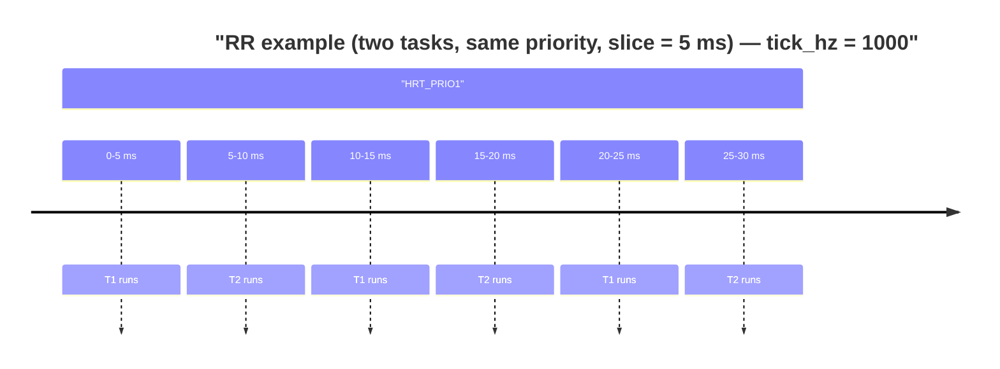
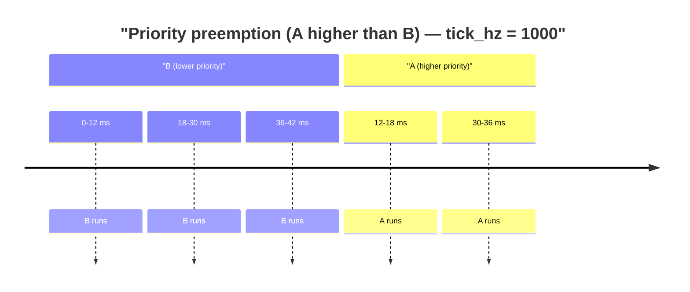

## 🧪 Examples (C)

This guide shows how to build and run the bundled `two_tasks` example with both the `null` and `posix` ports, and how to observe round-robin behavior.

### Build with the null port

```bash
cmake -DHEARTOS_PORT=null -DHEARTOS_BUILD_EXAMPLES=ON ..
cmake --build . --target two_tasks -j
./examples/two_tasks/two_tasks
```
Expected output (program exits immediately; no live scheduling):
```
HeaRTOS version: 0.2.0 (0x000200), port: null (id=0)
```
Notes:
- The null port doesn’t start a tick or switch contexts; `hrt_start()` returns.

### Build with the POSIX port

```bash
cmake -DHEARTOS_PORT=posix -DHEARTOS_BUILD_EXAMPLES=ON ..
cmake --build . --target two_tasks -j
./examples/two_tasks/two_tasks
```
Expected output (excerpt; continues indefinitely):
```
HeaRTOS version: 0.2.0 (0x000200), port: posix (id=1)
[A] tick count [0]
[B] tock -----
[A] tick count [1]
[A] tick count [2]
[B] tock -----
...
```
- Task A sleeps 500 ms; Task B sleeps 1000 ms. With `HRT_SCHED_PRIORITY_RR`, Task A has priority 0 (higher), Task B priority 1; thus Task A runs whenever READY.

### Seeing round-robin within a priority class

To observe time-slice rotation, create two tasks with the same priority and non-zero `timeslice`:

```c
#include "heartos.h"
#include <stdio.h>

static uint32_t sa[2048], sb[2048];
static void t1(void*){ for(;;){ puts("T1"); hrt_sleep(10); } }
static void t2(void*){ for(;;){ puts("T2"); hrt_sleep(10); } }

int main(void){
    hrt_config_t cfg = { .tick_hz=1000, .policy=HRT_SCHED_PRIORITY_RR, .default_slice=5 };
    hrt_init(&cfg);
    hrt_task_attr_t a = { .priority=HRT_PRIO1, .timeslice=5 };
    hrt_create_task(t1, 0, sa, 2048, &a);
    hrt_create_task(t2, 0, sb, 2048, &a);
    hrt_start();
}
```
You should see `T1` and `T2` alternate over time as their slices expire.

---

## Visualizing scheduling

### Round‑robin within one priority (Timeline)

Caption:
- Policy: `HRT_SCHED_PRIORITY_RR` (RR applies within same priority).
- Two READY tasks at the same priority with `timeslice=5 ms`. No sleeps/blocks during the shown window.
- Rotation is FIFO and contiguous: T1 0–5 ms, T2 5–10 ms, T1 10–15 ms, T2 15–20 ms, T1 20–25 ms, T2 25–30 ms.

### Priority preemption (Timeline)

Caption:
- B (lower) runs initially. At 12 ms, A (higher) becomes READY and preempts B; A runs 12–18 ms.
- B resumes 18–30 ms until A arrives again at 30 ms and preempts 30–36 ms; B then resumes at 36 ms.
- Shows two preemption events to make the behavior unmistakable (higher priority always wins when READY).