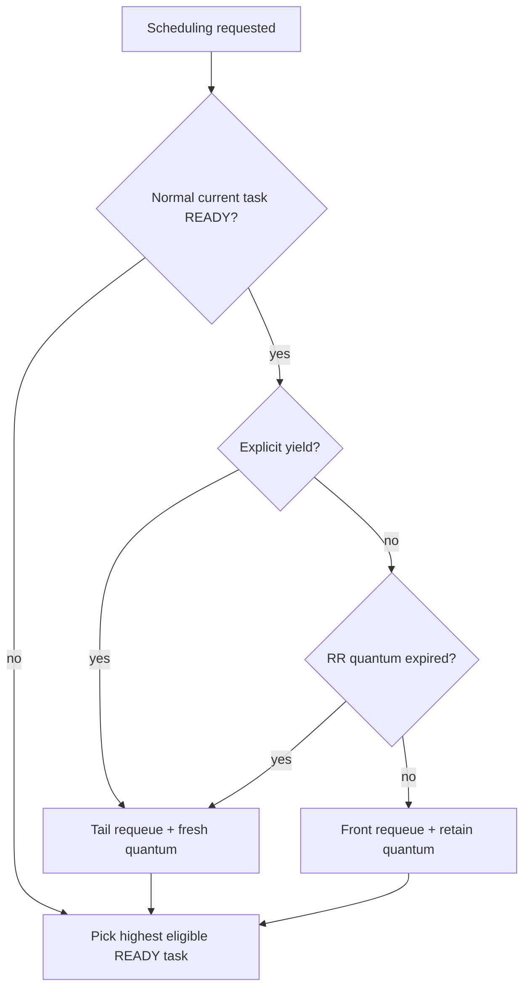

# Scheduler contract

This page documents the scheduler semantics implemented on `develop` for the v0.5 line. It intentionally distinguishes the current development contract from behavior shipped in v0.4.0.

Priority `0` is the highest priority. Unless otherwise stated, READY tasks are ordered FIFO within a priority class.

## Policies

### `HRT_SCHED_PRIORITY`

- The highest-priority READY class always dominates lower-priority classes.
- A newly READY task preempts the running task only when it has strictly higher priority, or when no normal task is running.
- Equal- and lower-priority wakes do not request a policy-visible context switch merely because they became READY.
- There is no tick-driven round-robin quantum under this policy.

### `HRT_SCHED_PRIORITY_RR`

Priority dominance is identical to `HRT_SCHED_PRIORITY`. Round-robin applies only among READY tasks in the selected priority class.

- A higher-priority wake preempts immediately at the earliest safe scheduling point.
- A task preempted by higher-priority work retains its queue precedence ahead of equal-priority peers and preserves its remaining `slice_left` value.
- When the higher-priority work blocks, sleeps, returns, or otherwise stops being READY, the interrupted task resumes before an equal-priority peer.
- Explicit yield and quantum expiry rotate the task to the tail exactly once and refresh the next quantum.
- A task that becomes READY after sleeping or blocking receives its configured fresh quantum.

The physically qualified STM32H755 trace for this contract is:

```text
low-A -> ISR/wake -> high -> low-A -> low-B
```

The validator also checks that low-A's observed remaining quantum matches the expected retained quantum within the fixture tolerance.

### `HRT_SCHED_RR`

The current implementation still stores READY work in per-priority queues. The final global priority-independent RR contract is tracked separately by #28. Code that depends on global RR ordering should not infer that contract from the current transitional representation.

## READY transition and `need_switch`

All wake paths use the same scheduler-aware decision.

For priority-based policies, a wake requires rescheduling when:

1. no normal task is currently running; or
2. the current task is not READY; or
3. the awakened task has strictly higher priority than the current READY task.

An equal- or lower-priority wake does not force a context switch solely because the task became READY.

ISR-facing synchronization APIs expose this decision through `need_switch`:

- `need_switch == 1` means the awakened task should run before the interrupted/current task under the active scheduler contract, or no normal task is running;
- `need_switch == 0` means the wake does not require an immediate scheduler handoff;
- ISR APIs never block;
- when a switch is required, the HardRT ISR API requests it internally. Application ISR code does not call a second yield hook.

## Scheduler-entry ownership

The core owns the outgoing READY-task transition exactly once. Ports request scheduling and save/restore context; they do not independently decide queue rotation.

| Cause | Outgoing task handling |
|---|---|
| task blocks, sleeps, is deleted, or returns | do not requeue |
| explicit `hrt_yield()` | requeue at tail once; refresh quantum |
| RR quantum expiry | requeue at tail once; refresh quantum |
| higher-priority asynchronous preemption | requeue at front precedence; preserve remaining quantum |
| first dispatch / idle | no normal outgoing task to requeue |

This prevents duplicate READY membership and keeps Cortex-M and POSIX on one logical scheduler contract even though their context-switch mechanisms differ.



## Tick wake behavior

Tick processing may make sleeping tasks READY and may expire an RR quantum. It requests scheduling only when the scheduler-aware wake rule or quantum-expiry rule requires it. Tick/ISR code never runs application task context directly.

Internal SysTick and application-owned external tick sources reach the same core tick semantics; their final hardware qualification matrix is tracked in #56.

## Port requirements

A port must preserve this logical ordering:

- reschedule requests are non-blocking and safe from supported kernel-aware ISR priorities;
- task-context APIs may transfer back to the scheduler;
- ISR/tick paths request a switch but do not directly switch into application task context;
- Cortex-M PendSV and equivalent mechanisms must observe the core's prepared outgoing-task state without adding a second queue transition.

See [PORTING.md](PORTING.md) for the complete port contract and [HARD_REAL_TIME.md](HARD_REAL_TIME.md) for timing-qualification requirements.