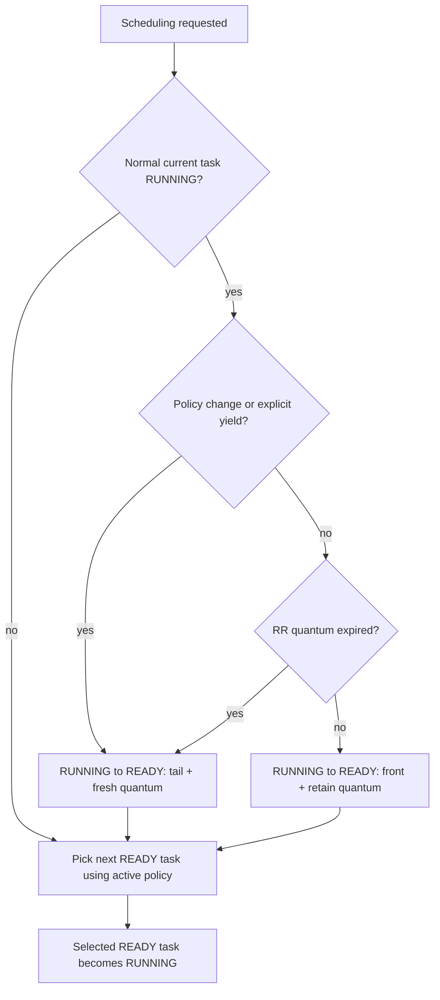

# Scheduler contract

This page documents the scheduler semantics implemented on `develop` for the v0.5 line. It intentionally distinguishes the current development contract from behavior shipped in v0.4.0.

Priority `0` is the highest priority. Priority values affect the two priority-based policies and are intentionally ignored by global round-robin.

## Task and slot lifecycle

Task execution state is distinct from TCB-slot ownership.

A TCB slot is either unused or used. Only a used slot contains a live or retained task record. A used task has one of these execution states:

- `READY`: runnable and present in the active READY representation;
- `RUNNING`: currently dispatched;
- `SLEEP`: waiting for its wake deadline;
- `BLOCKED`: waiting on a synchronization primitive;
- `EXITED`: no longer schedulable, but still represented by its used TCB slot until later reclamation.

`UNUSED` is therefore not a task execution state. This distinction makes the scheduler invariant explicit instead of inferring the running task from a READY TCB that happens not to be queued.

## Policies

### `HRT_SCHED_PRIORITY`

- READY tasks use one FIFO per priority class.
- The highest-priority READY class always dominates lower-priority classes.
- A newly READY task preempts the RUNNING task only when it has strictly higher priority, or when no normal application task is running.
- Equal- and lower-priority wakes do not request a policy-visible context switch merely because they became READY.
- There is no tick-driven round-robin quantum under this policy.
- An explicit `hrt_yield()` moves the RUNNING task back to READY at the tail of its own priority FIFO.

### `HRT_SCHED_PRIORITY_RR`

Priority dominance is identical to `HRT_SCHED_PRIORITY`. Round-robin applies only among READY tasks in the selected priority class.

- A higher-priority wake preempts immediately at the earliest safe scheduling point.
- A RUNNING task preempted by higher-priority work retains its queue precedence ahead of equal-priority peers and preserves its remaining `slice_left` value when it is republished as READY.
- When the higher-priority work blocks, sleeps, returns, or otherwise stops running, the interrupted task resumes before an equal-priority peer.
- Explicit yield and quantum expiry rotate the task to the tail exactly once and refresh the next quantum.
- A task that becomes READY after sleeping or blocking receives its configured fresh quantum.

The physically qualified STM32H755 trace for this contract is:

```text
low-A -> ISR/wake -> high -> low-A -> low-B
```

The validator also checks that low-A's observed remaining quantum matches the expected retained quantum within the fixture tolerance.

### `HRT_SCHED_RR`

`HRT_SCHED_RR` is true global round-robin on `develop`.

- All READY application tasks share one intrusive FIFO regardless of priority.
- Task priority does not affect selection, wake order, or rotation under this policy.
- Initial READY order follows insertion order.
- A RUNNING task that yields or exhausts a non-zero quantum becomes READY at the global FIFO tail and receives a fresh quantum.
- A task made READY after sleeping or blocking joins the global FIFO tail with a fresh quantum.
- A wake does not steal the RUNNING task's remaining quantum merely because the woken task has a numerically higher priority.
- When no normal application task is RUNNING, a wake requests scheduling as usual.
- `timeslice == 0` keeps the task cooperative: ticks do not rotate it, but explicit yield/block/sleep still creates scheduling points.

This is intentionally distinct from v0.4.0, where `HRT_SCHED_RR` still selected through the per-priority queues.

## READY representations

HardRT uses one intrusive task-ID link per task. Only the representation required by the active policy owns READY membership:

```text
PRIORITY / PRIORITY_RR:
    priority bitmap -> per-priority FIFO -> task IDs

RR:
    one global FIFO -> task IDs
```

A task is never simultaneously a member of both representations. The RUNNING task is not a member of a READY queue. The idle task is not part of either application READY queue.

This preserves the ready-side structural properties established during the v0.5 scheduler work:

- static storage only;
- no dynamic allocation;
- O(1) FIFO insertion/removal;
- fixed-word highest-priority selection for priority-based policies;
- O(1) global FIFO selection for `HRT_SCHED_RR`.

## Runtime policy switching

`hrt_set_policy()` supports switching among all three policies.

The core performs the transition under the scheduler critical section:

1. snapshot the queued READY tasks in the old policy's deterministic selection order;
2. clear the old READY representation;
3. select the target policy;
4. rebuild the target READY representation exactly once per queued task;
5. refresh READY-task quanta;
6. treat a RUNNING application task as reaching a scheduling point and rejoin it as READY at the target policy's tail.

For priority-to-global conversion, the old priority queues are flattened from highest to lowest priority while preserving FIFO order inside each priority class. Once global RR is active, subsequent rotation is priority-independent.

For global-to-priority conversion, global FIFO order is preserved within each resulting priority class.

Changing to the already-active policy is a no-op.

Policy switching is a task-context operation. ISR code should not change scheduler policy.

## READY transition and `need_switch`

All wake paths use the same scheduler-aware decision.

For `HRT_SCHED_PRIORITY` and `HRT_SCHED_PRIORITY_RR`, a wake requires rescheduling when:

1. no normal application task is RUNNING; or
2. the awakened task has strictly higher priority than the RUNNING application task.

An equal- or lower-priority wake does not force a context switch solely because the task became READY.

For `HRT_SCHED_RR`:

1. if no normal application task is RUNNING, the wake requests scheduling;
2. otherwise the awakened task joins the global FIFO tail and does not preempt the current RUNNING task.

ISR-facing synchronization APIs expose this decision through `need_switch`:

- `need_switch == 1` means the active scheduler requires an immediate handoff, or no normal application task is RUNNING;
- `need_switch == 0` means the wake does not require an immediate scheduler handoff;
- ISR APIs never block;
- when a switch is required, the HardRT ISR API requests it internally. Application ISR code does not call a second yield hook.

## Scheduler-entry ownership

The core owns the outgoing RUNNING-task transition exactly once. Ports request scheduling and save/restore context; they do not independently decide queue rotation.

| Cause | Outgoing task handling |
|---|---|
| task blocks | state is already BLOCKED; do not requeue |
| task sleeps | state is already SLEEP; do not requeue |
| task is deleted or returns | state is EXITED; do not requeue |
| explicit `hrt_yield()` | RUNNING -> READY at active-policy tail once; refresh quantum |
| RR quantum expiry | RUNNING -> READY at active-policy tail once; refresh quantum |
| priority-policy higher-priority asynchronous preemption | RUNNING -> READY at front precedence; preserve remaining quantum |
| scheduling request with no rotation cause | RUNNING -> READY at front; preserve remaining quantum |
| runtime policy change | rebuild queued READY tasks; RUNNING task rejoins target-policy tail as READY |
| first dispatch / idle | no normal outgoing application task to requeue |

Selection removes one task from READY storage and changes it to RUNNING. This gives the kernel a direct invariant:

```text
READY   => queued in exactly one active READY representation
RUNNING => current task and not READY-queued
SLEEP   => sleep-queue member
BLOCKED => waiting on one blocking primitive
EXITED  => not present in scheduler/wait structures
```

This prevents duplicate READY membership and keeps Cortex-M and POSIX on one logical scheduler contract even though their context-switch mechanisms differ.



## Tick wake behavior

Tick processing may make sleeping tasks READY and may expire the RUNNING task's RR quantum. It requests scheduling only when the scheduler-aware wake rule or quantum-expiry rule requires it. Tick/ISR code never runs application task context directly.

Internal SysTick and application-owned external tick sources reach the same core tick semantics; their final hardware qualification matrix is tracked in #56.

## Port requirements

A port must preserve this logical ordering:

- reschedule requests are non-blocking and safe from supported kernel-aware ISR priorities;
- task-context APIs may transfer back to the scheduler;
- ISR/tick paths request a switch but do not directly switch into application task context;
- Cortex-M PendSV and equivalent mechanisms must observe the core's prepared outgoing-task state without adding a second queue transition;
- the selected task is published as RUNNING at the dispatch boundary.

See [PORTING.md](PORTING.md) for the complete port contract and [HARD_REAL_TIME.md](HARD_REAL_TIME.md) for timing-qualification requirements.
